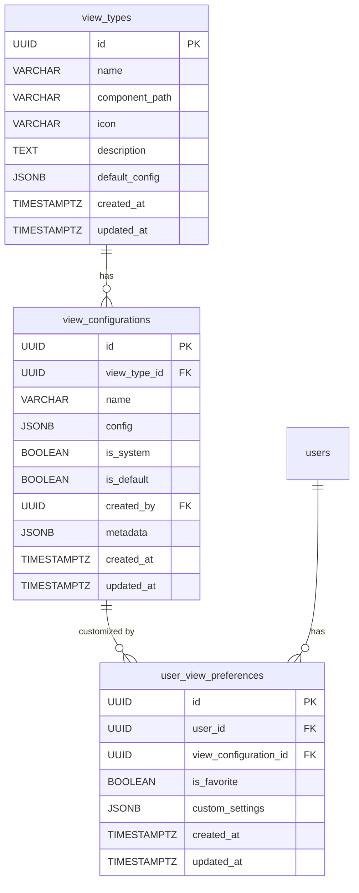
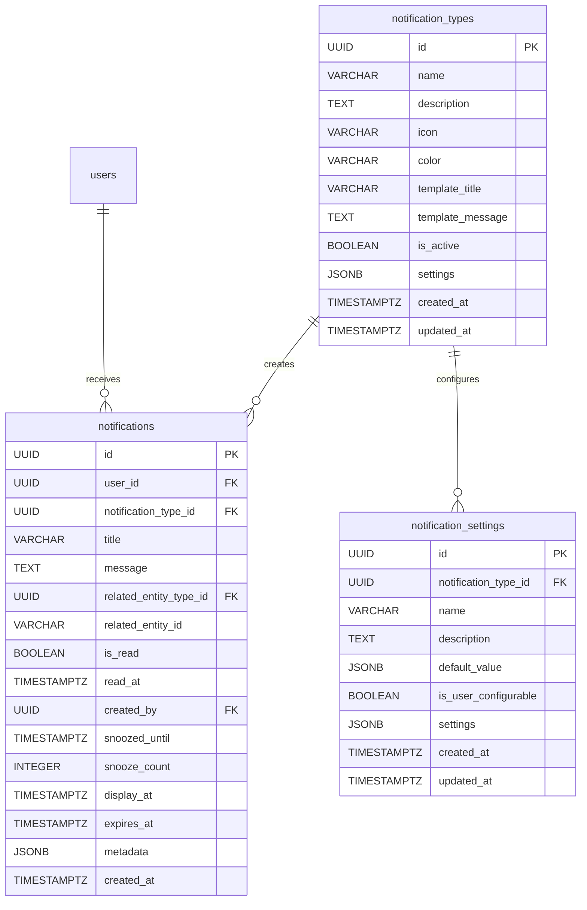
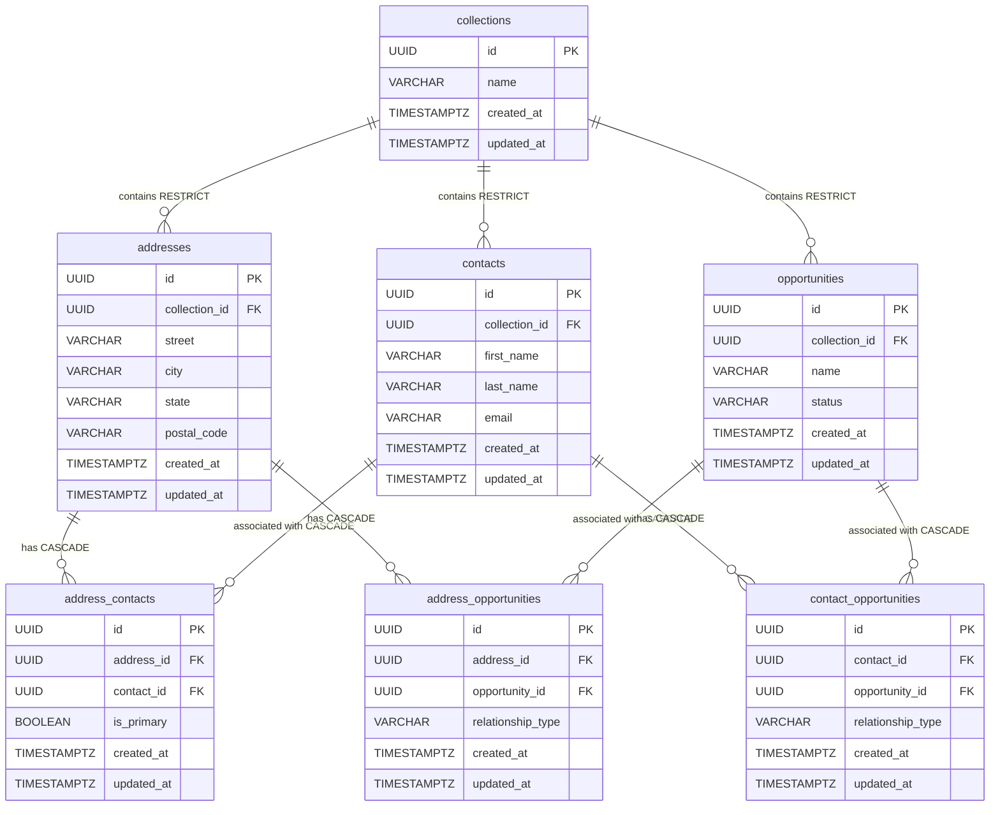

# SalesBlanket v4 Entity Relationship Diagram

This document contains the entity relationship diagram (ERD) for the SalesBlanket v4 database schema.

## Core Entities and Relationships

```mermaid
erDiagram
    %% Core Foundation Tables
    core_settings {
        UUID id PK
        VARCHAR setting_key
        JSONB setting_value
        TIMESTAMPTZ created_at
        TIMESTAMPTZ updated_at
    }
    
    permissions {
        UUID id PK
        VARCHAR name
        TEXT description
        VARCHAR resource
        VARCHAR action
        VARCHAR status
        UUID entity_type_id FK
        TIMESTAMPTZ created_at
        TIMESTAMPTZ updated_at
        JSONB metadata
    }
    
    activity_log {
        UUID id PK
        UUID user_id FK
        UUID entity_id
        VARCHAR entity_type
        VARCHAR action
        TIMESTAMPTZ occurred_at
        VARCHAR ip_address
        TEXT user_agent
        JSONB device
        JSONB geo
        JSONB meta
    }
    
    %% Type Definition Tables
    entity_types {
        UUID id PK
        VARCHAR display_name
        VARCHAR parent_category
        BOOLEAN is_filterable
        JSONB settings
        TIMESTAMPTZ created_at
        TIMESTAMPTZ updated_at
    }
    
    zone_types {
        UUID id PK
        VARCHAR display_name
        INTEGER level_order
        TEXT description
        VARCHAR icon
        VARCHAR default_color
        NUMERIC default_opacity
        INTEGER default_line_width
        UUID[] allowed_parent_type_ids
        UUID[] allowed_child_type_ids
        BOOLEAN allow_boundary_crossing
        JSONB default_settings
        TIMESTAMPTZ created_at
        TIMESTAMPTZ updated_at
    }
    
    %% User Management Tables
    users {
        UUID id PK
        VARCHAR username
        VARCHAR password_hash
        VARCHAR email
        VARCHAR first_name
        VARCHAR last_name
        VARCHAR status
        VARCHAR avatar_url
        TIMESTAMPTZ last_login
        JSONB preferences
        JSONB metadata
        TIMESTAMPTZ created_at
        TIMESTAMPTZ updated_at
    }
    
    user_roles {
        UUID id PK
        UUID user_id FK
        UUID role_id FK
        JSONB settings
        TIMESTAMPTZ created_at
    }
    
    %% Geographic Framework Tables
    zones {
        UUID id PK
        UUID zone_type_id FK
        UUID parent_zone_id FK
        VARCHAR name
        TEXT description
        VARCHAR status
        GEOGRAPHY boundary
        VARCHAR color
        NUMERIC opacity
        INTEGER line_width
        JSONB settings
        JSONB metadata
        TIMESTAMPTZ created_at
        TIMESTAMPTZ updated_at
    }
    
    entity_zones {
        UUID id PK
        VARCHAR entity_id
        UUID zone_id FK
        VARCHAR relationship_type
        BOOLEAN is_primary
        JSONB metadata
        TIMESTAMPTZ created_at
        TIMESTAMPTZ updated_at
    }
    
    %% Entity Tables
    addresses {
        UUID id PK
        VARCHAR name
        VARCHAR street
        VARCHAR address_line_2
        VARCHAR city
        VARCHAR state
        VARCHAR postal_code
        VARCHAR status
        TEXT notes
        JSONB property_condition
        TIMESTAMPTZ next_knock_date
        UUID street_id FK
        UUID neighborhood_id FK
        UUID created_by FK
        GEOGRAPHY location_geo
        JSONB metadata
        TIMESTAMPTZ created_at
        TIMESTAMPTZ updated_at
    }
    
    contacts {
        UUID id PK
        VARCHAR first_name
        VARCHAR last_name
        VARCHAR email
        TEXT notes
        VARCHAR facebook
        VARCHAR x
        VARCHAR instagram
        VARCHAR linkedin
        VARCHAR cover_photo
        VARCHAR status
        BOOLEAN contact_approval
        UUID contact_type_id FK
        UUID created_by FK
        UUID updated_by FK
        JSONB metadata
        TIMESTAMPTZ created_at
        TIMESTAMPTZ updated_at
    }
    
    address_contacts {
        UUID id PK
        UUID address_id FK
        UUID contact_id FK
        UUID contact_type_id FK
        BOOLEAN is_primary
        JSONB metadata
        TIMESTAMPTZ created_at
        TIMESTAMPTZ updated_at
    }
    
    opportunities {
        UUID id PK
        UUID opportunity_type_id FK
        VARCHAR status
        TEXT notes
        UUID created_by FK
        JSONB metadata
        TIMESTAMPTZ created_at
        TIMESTAMPTZ updated_at
    }
    
    %% Entity Engagement Tables
    entity_engagements {
        UUID id PK
        VARCHAR entity_id
        UUID entity_type_id FK
        UUID user_id FK
        UUID engagement_role_id FK
        TIMESTAMPTZ assigned_at
        UUID assigned_by FK
        BOOLEAN is_active
        JSONB metadata
        TIMESTAMPTZ created_at
        TIMESTAMPTZ updated_at
    }
    
    %% Entity Cards & Pulse System Tables
    entity_card_pulse {
        UUID id PK
        VARCHAR entity_id
        UUID entity_type_id FK
        VARCHAR pulse_type
        TIMESTAMPTZ last_synced
        JSONB metadata
        TIMESTAMPTZ created_at
        TIMESTAMPTZ updated_at
    }
    
    %% Key Relationships
    users ||--o{ user_roles : "has"
    entity_types ||--o{ permissions : "has"
    
    zones }o--|| zone_types : "is type of"
    zones }o--o{ entity_zones : "contains"
    
    addresses ||--o{ address_contacts : "has"
    contacts ||--o{ address_contacts : "associated with"
    
    opportunities }o--|| opportunity_types : "is type of"
    
    entity_types ||--o{ entity_engagements : "enables"
    users ||--o{ entity_engagements : "participates in"
    
    entity_types ||--o{ entity_card_pulse : "has"
```

## Additional Entity Clusters

### View System Tables

### Notification System

## Database Cascading Delete Configuration

### Collection-Entity Relationships

| Relationship | Foreign Key | On Delete | Description |
|--------------|-------------|-----------|-------------|
| Collection → Address | addresses.collection_id | RESTRICT | Prevents collection deletion if addresses exist |
| Collection → Contact | contacts.collection_id | RESTRICT | Prevents collection deletion if contacts exist |
| Collection → Opportunity | opportunities.collection_id | RESTRICT | Prevents collection deletion if opportunities exist |

### Entity-Entity Relationships (Junction Tables)

| Relationship | Foreign Key | On Delete | Description |
|--------------|-------------|-----------|-------------|
| Address → Address_Contact | address_contact.address_id | CASCADE | When address deleted, remove all relationship records |
| Contact → Address_Contact | address_contact.contact_id | CASCADE | When contact deleted, remove all relationship records |
| Address → Address_Opportunity | address_opportunity.address_id | CASCADE | When address deleted, remove all relationship records |
| Opportunity → Address_Opportunity | address_opportunity.opportunity_id | CASCADE | When opportunity deleted, remove all relationship records |
| Contact → Contact_Opportunity | contact_opportunity.contact_id | CASCADE | When contact deleted, remove all relationship records |
| Opportunity → Contact_Opportunity | contact_opportunity.opportunity_id | CASCADE | When opportunity deleted, remove all relationship records |

### Visual Representation of Cascading Relationships

This document will continue to evolve as we refine the database schema and establish additional relationships between entities.