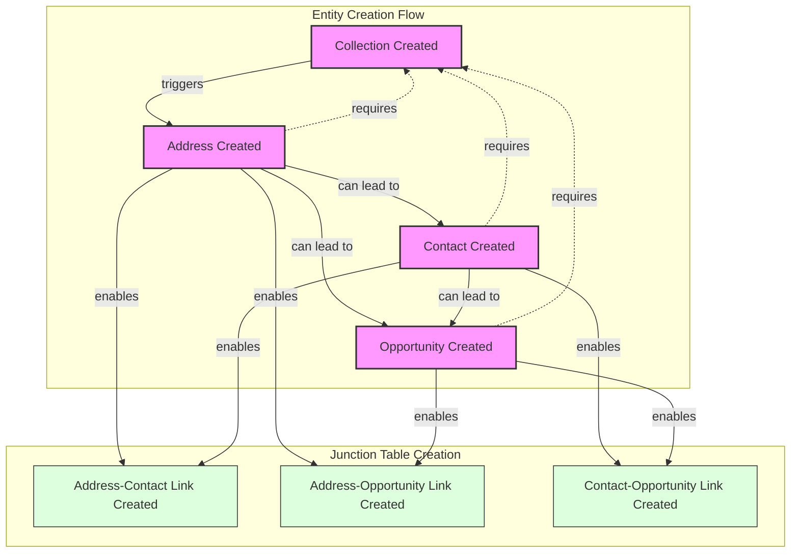
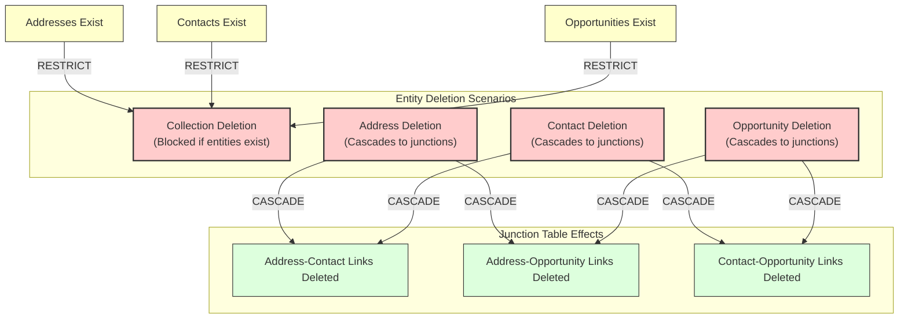
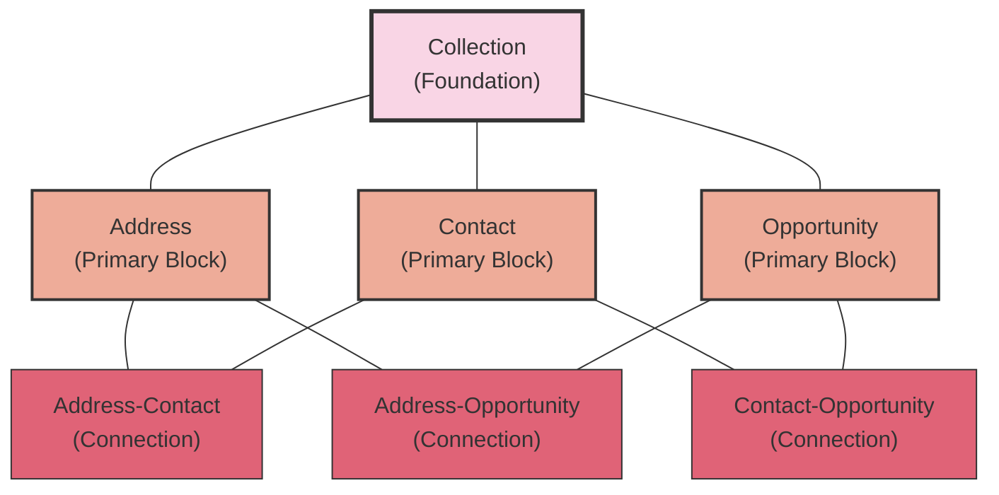
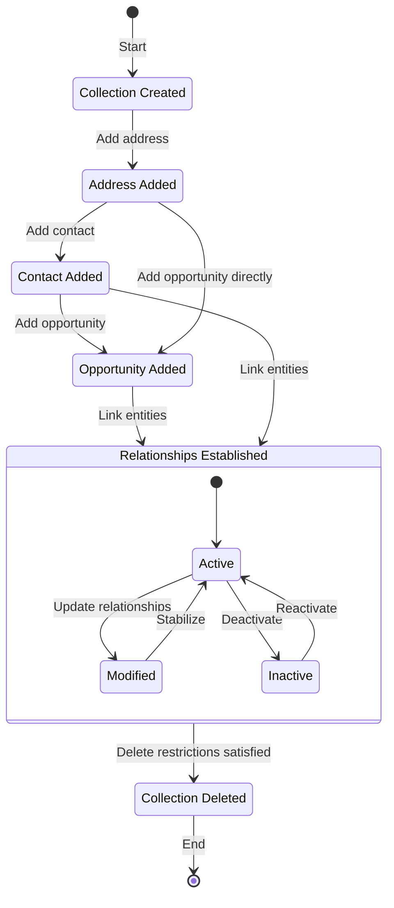
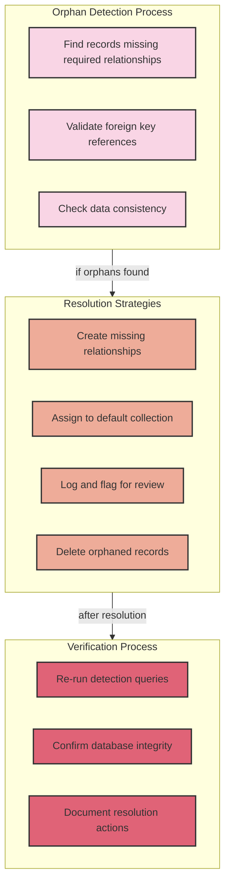

# Data Propagation and Entity Lifecycle Management

This document outlines how data propagates through the SalesBlanket v4 database when entities are created, related, and deleted. It ensures data integrity by preventing orphaned records and maintaining proper relationship chains.

## Entity Creation and Relationship Propagation

## Entity Deletion and Cascade Effects

## LEGO Block Analogy for Data Building

In our database design, we use a "LEGO block" approach to data building:

1. **Foundation Block (Collection)**: Every data structure begins with a Collection
2. **Primary Blocks (Entities)**: Addresses, Contacts, and Opportunities attach to Collections
3. **Connection Blocks (Junctions)**: Address-Contact, Address-Opportunity, and Contact-Opportunity links connect entities together
4. **Structural Integrity**: Rules prevent removing foundation blocks while structures are built on top

## Entity Lifecycle State Transitions

## Preventing Orphaned Records

### Orphan Prevention Mechanisms

1. **Foreign Key Constraints**:
   - All entity tables (addresses, contacts, opportunities) have foreign keys to their collection
   - Junction tables have properly configured foreign keys to their parent entities

2. **ON DELETE Actions**:
   - RESTRICT: Prevents deletion of a collection if dependent entities exist
   - CASCADE: Automatically removes junction records when a parent entity is deleted

3. **Application-Level Validation**:
   - Ensures new entities are always associated with a valid collection
   - Verifies relationship integrity before allowing entity creation

### Orphan Detection and Resolution

## Database Trigger System for Data Propagation

For automated data integrity and propagation, the system implements database triggers:

1. **BEFORE INSERT Triggers**:
   - Validate that required related entities exist
   - Generate any required default values or relationships

2. **AFTER INSERT Triggers**:
   - Create complementary records in related tables
   - Update statistical counters and aggregates

3. **BEFORE DELETE Triggers**:
   - Check if deletion would violate integrity constraints
   - Prepare related data for cascading operations

4. **AFTER DELETE Triggers**:
   - Clean up any remaining references
   - Update statistical counters and aggregates

This comprehensive approach ensures data integrity throughout the entity lifecycle, preventing orphaned records while enabling the flexible "building block" approach to data construction.